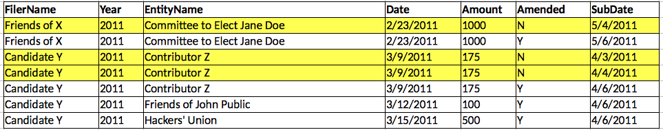
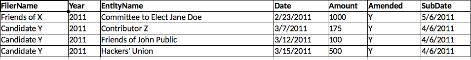

**DemHack Campaign Finance Reports Data**

GOALS - Developers can assist in making Campaign Finance Data more accessible to the public through:

1. **Data visualizations:** Analyzing the data to create visualizations that allow members of the public to immediately consume the meaning of this data. Potential visualizations include:

    1. A dashboard to present total contributions and/or expenditures to candidate committees during a particular time period.

    2. Timelines of contributions of expenditures to candidate committees or political committees.

    3. Heat maps of numbers of contributions or contribution amounts for a particular election in a particular geographic area.

2. **Removing Duplicates****:** Creating a technical solution to remove duplicate transactions (i.e. prior versions of campaign finance reports), which pose a challenge to creating visualizations.

DATA VISUALIZATIONS: See GitHub documentation for ideas and further information about this dataset: [https://github.com/CityOfPhiladelphia/campaign-finance-data-cleanup](https://github.com/CityOfPhiladelphia/campaign-finance-data-cleanup)

REMOVING DUPLICATES - The inclusion of duplicate transactions (generally due to amendments) would significantly distort any analysis of this data. With over 250,000 rows of data in a single YTD file, manually identifying and removing these duplicate amendments is an onerous and unrealistic process. We seek a tech solution to automatically identify and remove duplicates from the dataset. 

The steps below outline a possible manual process for removing duplicates due to amendments. The most important field for identifying duplicates is the SubDate (column V). Following the sorting steps below will align the most recent reports with their respective prior amendments.

 

1. Sort by Filename

2. Then by DocType

3. Then By EntityName

4. Then by Date

5. Then by SubDate

6. After the sorting steps above, you will see transactions grouped with their amendments. Ignore Columns C (Cycle), U (Amended) and T (Description). Generally, if everything in 

the remaining columns for a group of transactions is identical except for the SubDate (when the report was submitted) then this indicates that those rows are duplicates and, by keeping only the transaction with the most recent submission date, and removing the others, you have dealt with the duplicates.  

  

*Example*: In the image below, the highlight rows represent duplicates: 

 

A technical solution for removing duplicates would yield this result:

